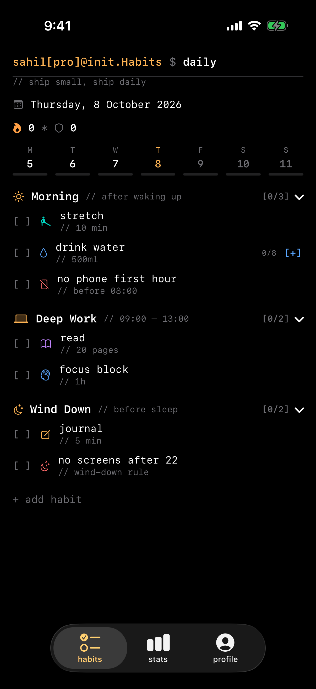
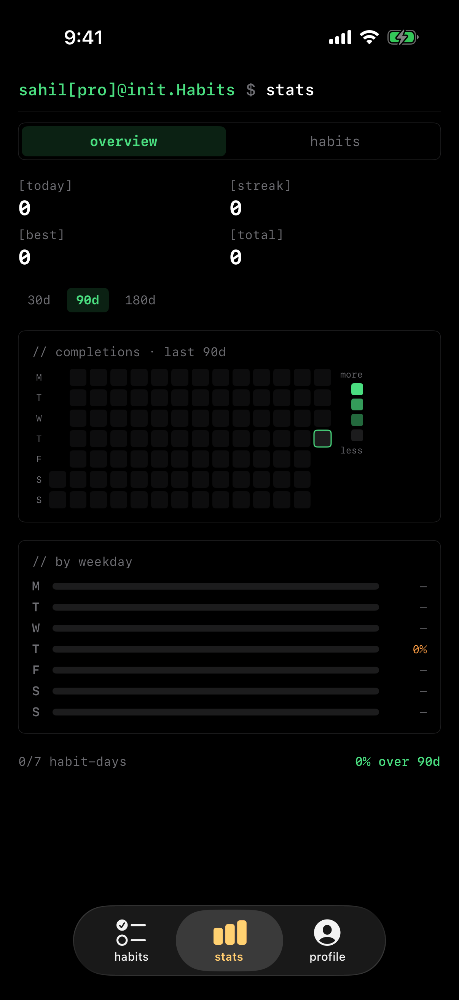
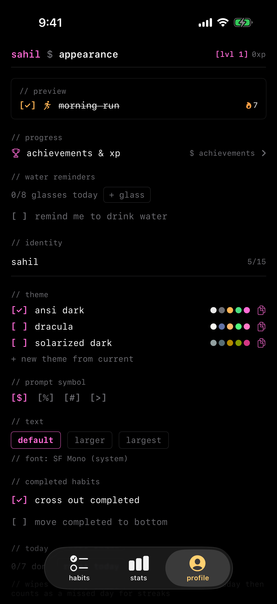

# Habits$

A daily habit tracker whose entire interface reads like a Unix shell session —
prompts, `//` comments, bracket checkboxes, monospace throughout.

## Platforms

| | Path | Status |
|---|---|---|
| iOS | [`ios/`](ios/) | SwiftUI + SwiftData, iOS 17+, home-screen widget, Live Activities |
| Android | [`android/`](android/) | Kotlin + Jetpack Compose, in progress |

## What it does

- **Habits tab** — prompt header, rotating taglines, a Mon–Sun week strip with
  per-day completion fill, collapsible routines, per-habit rows with streak
  flames and completion timestamps.
- **Habit types** — check-off and timed. A timed habit shows a live
  `⏱ hh:mm:ss / target` counter; tapping starts and stops it and logs elapsed.
- **Stats tab** — today / streak / 30-day / total tiles, a five-week completion
  heatmap, and a per-habit deep dive over `7d/30d/90d/365d/all`.
- **Profile tab** — username, themes (ansi dark / dracula / solarized dark),
  prompt symbol, text sizes, and layout toggles with a live preview.

Streaks are always derived from completion history, never stored.

## Screenshots

| Habits | Stats | Profile |
|---|---|---|
|  |  |  |

## iOS

```bash
brew install xcodegen          # once
cd ios && xcodegen generate
open Habits.xcodeproj
```

Pick the Habits scheme and an iPhone simulator, then ⌘R. Requires Xcode 16+ /
iOS 17+. See [`ios/README.md`](ios/README.md) for device installs, the debug
driving hooks, and the module layout.

## Android

Not yet. See `android/README.md` once it exists.
